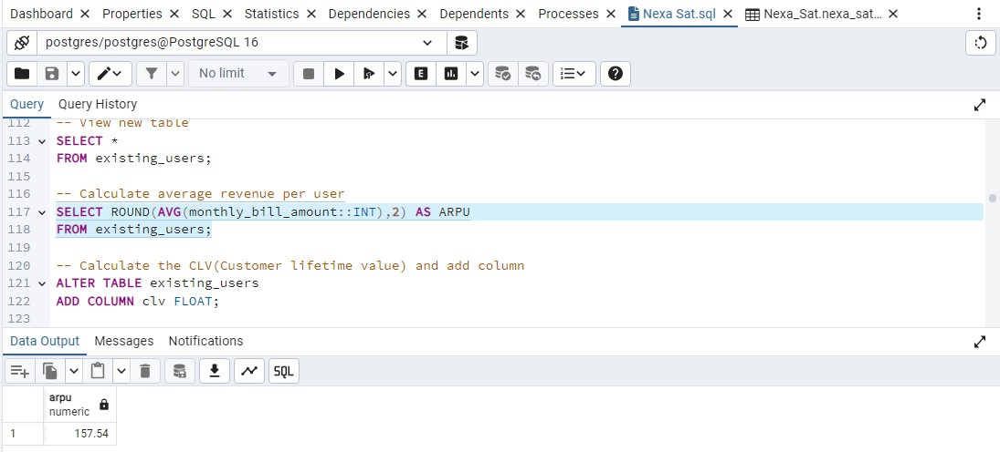
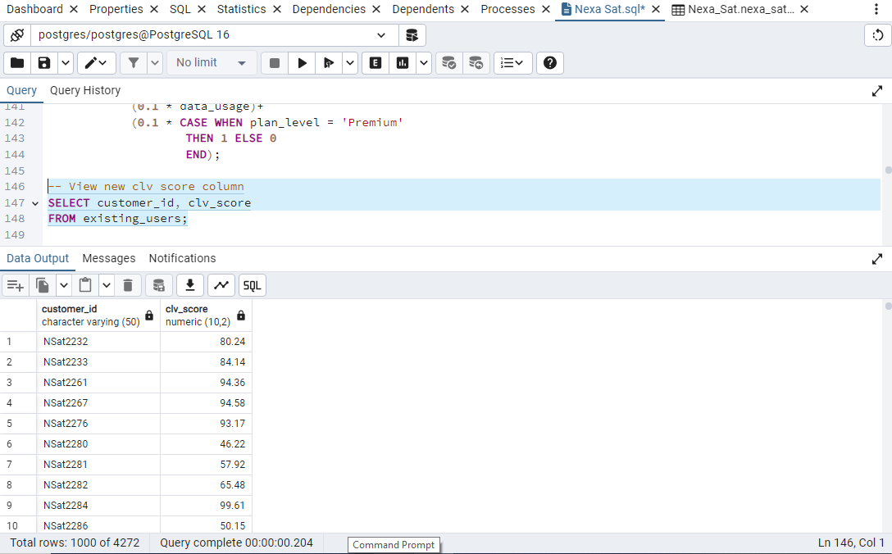
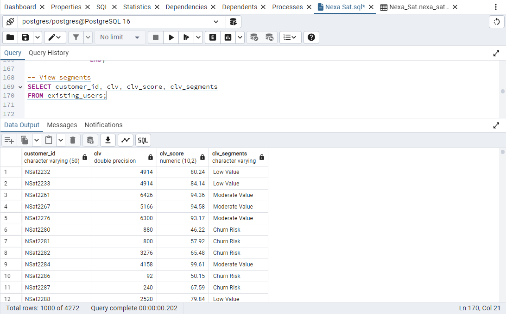
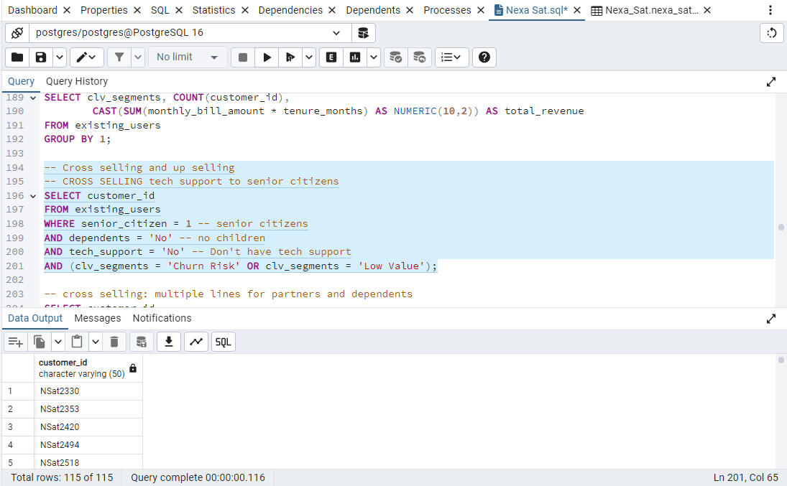
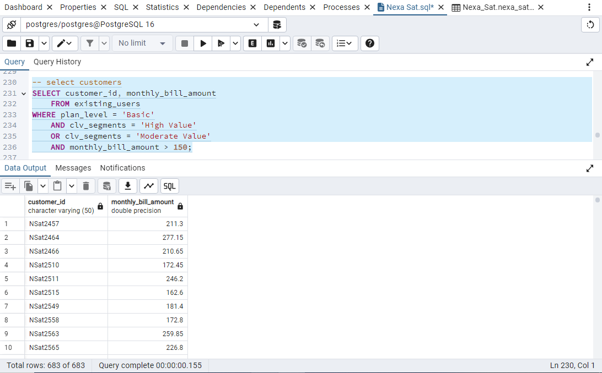

# Nexasat

## Project Overview: Enhancing Revenue Strategies with CLV Segmentation


### Business Challenge
NexaSat, a prominent player in the telecommunications industry, faces a critical dilemma: how to optimize marketing efforts and resource allocation. Their diverse customer base—ranging from occasional users to loyal enthusiasts—requires a tailored approach. As competition intensifies, NexaSat aims to maximize revenue from existing customers while identifying high-potential prospects. The challenge lies in pinpointing receptive customers and crafting personalized offers.

### Untapped Potential
NexaSat recognizes untapped opportunities within its customer base. Personalized offers and bundled services could boost Average Revenue Per User (ARPU). However, without a structured approach, their up-selling and cross-selling efforts yield suboptimal results.

### The Solution: CLV Segmentation
- What is CLV Segmentation?
  - A data-driven strategy categorizing customers based on long-term value.
  - Enables targeted marketing and tailored services.
  - Optimizes resource allocation and strengthens customer relationships.

- NexaSat's Goal
  - Unlock up-selling and cross-selling opportunities.
  - Design personalized offers for each segment.
  - Focus on high-opportunity segments for maximum ROI.
  - Strengthen loyalty in a competitive telecom landscape.

### Project Aim
Implement CLV segmentation to strategically boost revenue, enhance average revenue per user (ARPU), and foster lasting customer satisfaction. NexaSat aims to secure a competitive edge by delivering tailored solutions aligned with customer preferences.

### Data Description
- Customer Data (July 2023):
  - Includes unique customer IDs, gender, partner status, dependents, senior citizen status, call duration, data usage, plan type (prepaid/postpaid), and plan level (basic/premium).

### Tech Stack
- PostgreSQL:
  - Used for data manipulation and analysis.

### Project Scope
1. Exploratory Data Analysis (EDA):
   - Examine customer data to uncover insights into behavior and preferences.
   - Understand demographic patterns and usage trends.

2. Feature Engineering:
   - Create relevant features like Customer Lifetime Value (CLV) and CLV scores.
   - These features will be crucial for segmentation.

3. Segmentation:
   - Categorize customers based on CLV scores.
   - Further segment based on demographics, usage, and service plans.

4. Segment Profiling and Strategy Formulation:
   - Understand each segment's unique traits.
   - Develop personalized marketing strategies (special offers, targeted promotions) aligned with customer preferences.

### Solution
```SQL

-- Query 1: Create Schema
CREATE SCHEMA Nexa.Sat;

-- Query 2: Create a table in the schema
CREATE TABLE "Nexa_Sat".nexa_sat (
    Customer_ID VARCHAR(50),
    gender VARCHAR(10),
    Partner VARCHAR(3),
    Dependents VARCHAR(3),
    Senior_Citizen INT,
    Call_Duration FLOAT,
    Data_Usage FLOAT,
    Plan_Type VARCHAR(20),
    Plan_Level VARCHAR(20),
    Monthly_Bill_Amount FLOAT,
    Tenure_Months INT,
    Multiple_Lines VARCHAR(3),
    Tech_Support VARCHAR(3),
    Churn INT);

```
```SQL
-- Import data

-- Set search path for queries
SET search_path TO "Nexa_Sat"

-- Confirm current schema
SELECT current_schema();

SELECT * FROM 
nexa_sat

-- Data Cleaning
-- Check for Duplicates

SELECT Customer_ID, gender, Partner, Dependents,
  Senior_Citizen, Call_Duration, Data_Usage,
  Plan_Type, Plan_Level, Monthly_Bill_Amount,
  Tenure_Months, Multiple_Lines, Tech_Support, 
  Churn
  FROM nexa_sat
  GROUP BY
  Customer_ID, gender, Partner, Dependents,
  Senior_Citizen, Call_Duration, Data_Usage,
  Plan_Type, Plan_Level, Monthly_Bill_Amount,
  Tenure_Months, Multiple_Lines, Tech_Support, 
  Churn
  HAVING COUNT(*) > 1 -- This will filter out duplicate rows

--Check for null values
SELECT *
FROM nexa_sat
WHERE Customer_ID IS NULL
OR gender IS NULL
OR Partner IS NULL
OR Dependents IS NULL
OR Senior_Citizen IS NULL
OR Call_Duration IS NULL
OR Data_Usage IS NULL
OR Plan_Type IS NULL
OR Plan_Level IS NULL
OR Monthly_Bill_Amount IS NULL
OR Tenure_Months IS NULL
OR Multiple_Lines IS NULL
OR Tech_Support IS NULL
OR Churn IS NULL;

---EDA Exploratory Data Analysis
-- Total Users

SELECT COUNT(Customer_ID) AS current_Users
FROM  nexa_sat
WHERE Churn = 0;

-- Total Users by Level
SELECT Plan_Level, COUNT(Customer_ID) AS current_Users
FROM  nexa_sat
WHERE Churn = 0
GROUP BY Plan_Level;

-- Total Revenue
SELECT CAST(SUM(Monthly_Bill_Amount) AS DECIMAL(18, 2)) AS Total_Revenue
FROM nexa_sat;

-- Revenue by plan level
SELECT plan_level, CAST(SUM(Monthly_Bill_Amount) AS DECIMAL(18, 2)) AS Revenue
FROM nexa_sat
GROUP BY 1
ORDER BY 2;

-- Churn count by plan type and plan level
SELECT plan_level,
	   plan_type,
	COUNT(*) AS Total_Customers,
	SUM(Churn) AS Churn_Count
FROM nexa_sat
GROUP BY 1,2
ORDER BY 1;

-- Average Tenure by plan level
SELECT plan_level, ROUND(AVG(tenure_months),2) AS Average_Tenure
FROM nexa_sat
GROUP BY 1;

```SQL
-- Marketing Strategies
-- Create a table of existing users only

CREATE TABLE existing_users AS
SELECT * FROM nexa_sat
WHERE Churn = 0;

-- View new table
SELECT * 
FROM existing_users;

-- Calculate average revenue per user
SELECT ROUND(AVG(monthly_bill_amount::INT),2) AS ARPU
FROM existing_users;
```


```SQL
-- Calculate the CLV(Customer lifetime value) and add a new column
ALTER TABLE existing_users
ADD COLUMN clv FLOAT;

UPDATE existing_users
SET clv = monthly_bill_amount * tenure_months;

-- View new column
SELECT customer_id, clv
FROM existing_users;

-- CLV SCORE
-- Monthly_bill = 40%, tenure = 30%, call_duration = 10%, data_usage = 10%, premium = 10%
ALTER TABLE existing_users
ADD COLUMN clv_score NUMERIC(10,2);

UPDATE existing_users
SET clv_score = 
			(0.4 * monthly_bill_amount)+
			(0.3 * tenure_months)+
			(0.1 * call_duration)+
			(0.1 * data_usage)+
			(0.1 * CASE WHEN plan_level = 'Premium'
			THEN 1 ELSE 0
END);

-- View new clv score column
SELECT customer_id, clv_score
FROM existing_users;
```


```SQL
-- Group users into segments based on their CSV scores
ALTER TABLE existing_users
ADD COLUMN clv_segments VARCHAR;

UPDATE existing_users
SET clv_segments = 
		CASE WHEN clv_score > (SELECT percentile_cont(0.85)
		WITHIN GROUP (ORDER BY clv_score)
		FROM existing_users ) THEN 'High Value'
		WHEN clv_score >= (SELECT percentile_cont(0.50)
		WITHIN GROUP (ORDER BY clv_score)
		FROM existing_users ) THEN 'Moderate Value'
		WHEN clv_score >=  (SELECT percentile_cont(0.25)
		WITHIN GROUP (ORDER BY clv_score)
		FROM existing_users ) THEN 'Low Value'
		ELSE 'Churn Risk'
END;

-- View segments
SELECT customer_id, clv, clv_score, clv_segments
FROM existing_users;

```
```SQL
-- Analyzing the segments
-- avg bill and tenure per segment
SELECT clv_segments, 
		ROUND(AVG(monthly_bill_amount::INT),2) AS avg_monthly_charges,
		ROUND(AVG(tenure_months::INT),2) AS avg_tenure
FROM existing_users
GROUP BY 1;

-- tech support  and multiple lines count
SELECT clv_segments,
	ROUND(AVG(CASE WHEN tech_support ='Yes' THEN 1 ELSE 0 END),2) AS tech_support_pct,
	ROUND(AVG(CASE WHEN multiple_lines = 'Yes' THEN 1 ELSE 0 END),2) AS multiple_line_pct
FROM existing_users
GROUP BY 1;

-- revenue per segment
SELECT clv_segments, COUNT(customer_id), 
		CAST(SUM(monthly_bill_amount * tenure_months) AS NUMERIC(10,2)) AS total_revenue 
FROM existing_users
GROUP BY 1;
```
```SQL
-- Cross-selling and up-selling
-- CROSS SELLING tech support to senior citizens
SELECT customer_id
FROM existing_users
WHERE senior_citizen = 1 -- senior citizens
AND dependents = 'No' -- no children
AND tech_support = 'No' -- Don't have tech support
AND (clv_segments = 'Churn Risk' OR clv_segments = 'Low Value');
```

###### NexaSat has 115 customers who are senior citizens but don't have tech support. They may require a little help to be able to enjoy their subscription plans. This will generate more revenue for the company

```SQL
-- Cross-selling: multiple lines for partners and dependents
SELECT customer_id
FROM existing_users
WHERE multiple_lines = 'No'
AND (dependents = 'Yes' OR partner = 'Yes')
AND plan_level = 'Basic';
```
```SQL
-- Cross-selling: Users who have been with the company for over a year, but don't have multiple lines
SELECT customer_id 
	FROM existing_users
WHERE tenure_months <= 12
	AND (dependents = 'Yes' OR partner = 'Yes')
	AND multiple_lines = 'No';
```
```SQL
-- UP-SELLING premium discounts for basic users with churn risk
SELECT customer_id
FROM existing_users
	WHERE plan_level ='Basic'
AND clv_segments ='Churn Risk';
```
```SQL
-- Up-selling: Basic to Premium for longer lock-in Period and higher ARPU
SELECT  plan_level, ROUND(AVG(monthly_bill_amount::INT),2) AS avg_bill,
	ROUND(AVG(tenure_months::INT),2) AS avg_tenure
	FROM existing_users
	WHERE clv_segments ='High Value'
	OR clv_segments = 'Moderate Value'
	GROUP BY 1;
```
```SQL
-- Offer discounts to customers who are on the basic plan but spend over 150 monthly
SELECT customer_id, monthly_bill_amount
	FROM existing_users
WHERE plan_level = 'Basic'
	AND clv_segments = 'High Value'
	OR clv_segments = 'Moderate Value'
	AND monthly_bill_amount > 150;
```


```SQL
-- CREATE STORED PROCEDURES
-- Senior citizens who will be offered tech support

CREATE FUNCTION  tech_support_snr_citizen()
	RETURNS TABLE(customer_id VARCHAR (50))
	AS $$
BEGIN
	RETURN QUERY
	SELECT eu.customer_id
FROM existing_users eu
WHERE eu.senior_citizen = 1 -- senior citizens
AND eu.dependents = 'No' -- no children
AND eu.tech_support = 'No' -- Don't have tech support
AND eu.clv_segments = 'Churn Risk' OR eu.clv_segments = 'Low Value';
END
	$$ LANGUAGE plpgsql;

-- at-risk customers who will be offered a premium discount
CREATE FUNCTION churn_risk_discount()
RETURNS TABLE(customer_id VARCHAR (50))
AS $$
BEGIN
	RETURN QUERY
	SELECT eu.customer_id
FROM existing_users eu
	WHERE eu.plan_level ='Basic'
AND eu.clv_segments ='Churn Risk';
END
	$$ LANGUAGE plpgsql;

-- High-usage customers who will be offered a premium upgrade
CREATE FUNCTION high_usage_basic()
RETURNS TABLE (customer_id VARCHAR(50))
AS $$
	BEGIN
	RETURN QUERY
	SELECT eu.customer_id
	FROM existing_users eu
WHERE plan_level = 'Basic'
	AND eu.clv_segments = 'High Value'
	OR eu.clv_segments = 'Moderate Value'
	AND eu.monthly_bill_amount > 150;
END
	$$ LANGUAGE plpgsql;

-- Premium discount for basic users
CREATE FUNCTION  basic_users_discount()
	RETURNS TABLE(customer_id VARCHAR (50))
	AS $$
BEGIN
	RETURN QUERY
SELECT eu.customer_id
FROM existing_users eu
	WHERE eu.plan_level ='Basic'
AND eu.clv_segments ='Churn Risk';
END
	$$ LANGUAGE plpgsql;
```

```SQL
-- USE PROCEDURES
-- churn risk discount
SELECT *
	FROM churn_risk_discount();

-- high usage basic customers
SELECT * FROM high_usage_basic();

-- premium for basic users
SELECT * FROM basic_users_discount()
	
-- END OF QUERY
```

## Discovery

- What did I learn?
I discovered that

1. Senior Citizens:
   - There are 115 senior citizens who may benefit from tech support due to their limited tech knowledge.
   - We can cross-sell tech support services to assist them with using our company's products.

2. Basic Plan Customers with Partners and Dependents:
   - Among the 376 people on the basic plan, some have partners and dependents.
   - We'll offer these customers multiple lines to accommodate their family needs.

3. New Customers with Dependents and Partners:
   - Among the 273 customers who joined within the last year, many have dependents and partners.
   - We'll provide them with multiple lines to meet their communication requirements.

4. Churn Risk and Premium Plan:
   - Users at high churn risk (especially those on the basic plan) should receive the premium plan.
   - As a bonus, we can sweeten the deal to retain them.

5. Discounted Premium Plan for High-Spending Basic Plan Customers:
   - The 683 existing customers on the basic plan but spending over $150 per month deserve an upgrade.
   - We'll offer them the premium plan at a discounted rate.
